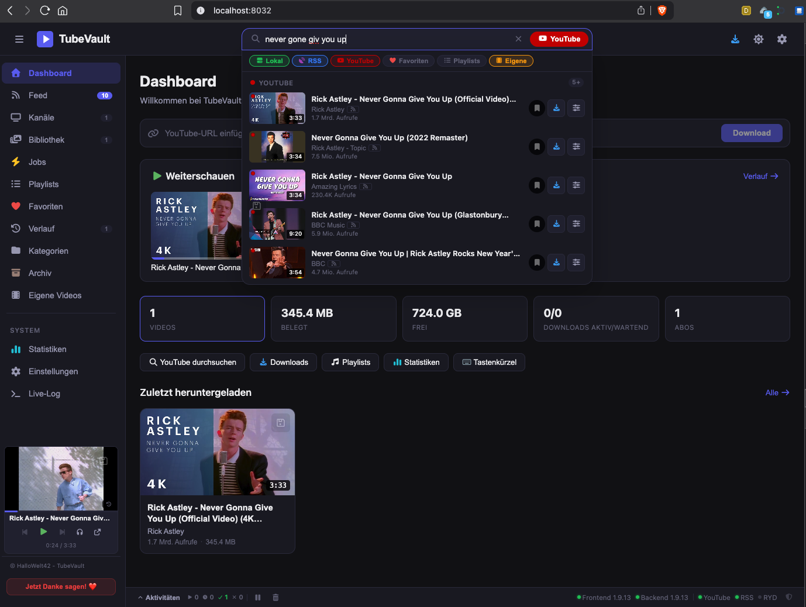

# TubeVault (BETA Version)


Beachte: 
    Aktuell wird kein API-KEY und https-Support bereitgestellt. Daher nur in sicheren Netzwerk Zuhause betreiben.


### **Dein selbstgehostetes Video-Vault -  Videos archivieren, streamen und verwalten.**

TubeVault läuft komplett auf deinem eigenen Raspberry Pi, Mac (oder jedem anderen Linux-Server). 
- Keine Cloud
- kein Tracking
- keine Werbung

### Deine Videos, dein Server, deine Daten.


<!-- Screenshot-Platzhalter: Ersetze die URL mit einem echten Screenshot -->



---


## Was kann TubeVault?

**Videos herunterladen & archivieren** -  YouTube-Videos in gewünschter Qualität lokal speichern. Automatisch Thumbnails, Metadaten und Untertitel mitziehen.

**Kanäle abonnieren** -  RSS-Feeds deiner Lieblingskanäle verfolgen. Neue Videos erscheinen im Feed, optional mit Auto-Download.

**Lokales Streaming** -  Alle gespeicherten Videos direkt im Browser abspielen. Kapitelmarken, Wiedergabeposition, Lyrics-Anzeige.

**Bibliothek verwalten** -  Kategorien, Playlists, Favoriten, Tags, Bewertungen. Volltextsuche über Titel, Beschreibungen und Notizen.

**Eigene Videos einbinden** -  Lokale Videodateien scannen, indexieren und in die Bibliothek aufnehmen.

**Backup & Export** -  Datenbank-Backups erstellen, wiederherstellen und herunterladen.

### Weitere Features

- MiniPlayer in der Sidebar
- Kapitelmarken & Ad-Marker
- Lyrics-Erkennung & -Anzeige
- Stream-Analyse (verfügbare Qualitäten/Formate)
- Kanal-Playlists synchronisieren
- Video-Archiv mit Mount-Unterstützung
- Like/Dislike-Daten via Return YouTube Dislike API
- Thumbnail-AI Anbindung (optional)
- Live-Log Terminal im Browser
- Statistik-Dashboard
- Dark Mode

---

## Tech Stack

| Komponente | Technologie |
|-----------|-------------|
| **Backend** | Python 3.12, FastAPI, SQLite, pytubefix, FFmpeg |
| **Frontend** | Svelte 5, Vite, Vanilla CSS |
| **Reverse Proxy** | Nginx (im Frontend-Container) |
| **Deployment** | Docker Compose |
| **Zielplattform** | Raspberry Pi 4/5 (ARM64), Linux-Server, macOS |

---

## Voraussetzungen

- **Hardware:** Raspberry Pi 4 (4 GB RAM+), Pi 5, beliebiger Linux-Server oder Mac
- **OS:** Raspberry Pi OS (64-bit), Debian, Ubuntu, macOS (mit Docker Desktop)
- **Software:** Docker + Docker Compose Plugin (auf macOS: Docker Desktop)
- **Speicherplatz:** Mindestens 10 GB frei (mehr für Video-Downloads)

---

## Installation

### 1. Docker installieren (falls nicht vorhanden)

**Linux (Raspberry Pi / Debian / Ubuntu):**

```bash
curl -fsSL https://get.docker.com | sh
sudo usermod -aG docker $USER
newgrp docker
```

**macOS:**

[Docker Desktop herunterladen](https://www.docker.com/products/docker-desktop/) und installieren. Docker Compose ist enthalten.

### 2. TubeVault herunterladen

```bash
git clone https://github.com/HalloWelt42/TubeVault.git
cd TubeVault
```

### 3. Setup ausführen

```bash
chmod +x setup.sh
./setup.sh
```

Das Script erstellt alle Datenverzeichnisse, legt die `.env`-Konfiguration an und prüft ob Docker bereit ist.

### 4. Starten

```bash
docker compose up -d --build
```

Der erste Build dauert je nach Hardware 5–15 Minuten.

### 5. Öffnen

```
http://<DEINE-IP>:8032
```

Die IP findest du mit `hostname -I`. Die API-Dokumentation (Swagger) erreichst du unter `http://<DEINE-IP>:8031/docs`.

---

## Konfiguration

Alle Einstellungen liegen in der `.env` Datei (wird beim Setup aus `.env.example` erzeugt):

```bash
nano .env
```

| Variable | Default | Beschreibung |
|----------|---------|-------------|
| `TUBEVAULT_BACKEND_PORT` | `8031`  | Backend API Port |
| `TUBEVAULT_FRONTEND_PORT` | `8032`  | Frontend Web-UI Port |
| `MAX_CONCURRENT_DOWNLOADS` | `1`     | Gleichzeitige Downloads (Pi 4: besser `1`) |
| `DEFAULT_QUALITY` | `720p`  | Standard-Qualität: `360p` `480p` `720p` `1080p` `best` |

Nach Änderungen neu starten:

```bash
docker compose up -d
```

---

## Externe Festplatte nutzen

Standardmäßig landen alle Daten im Projektordner unter `./data/`. Für größere Sammlungen kannst du einzelne Verzeichnisse auf eine externe Platte auslagern.

Beispiel: USB-Festplatte unter `/mnt/usb` gemountet:

```yaml
# In docker-compose.yml die Zeile ersetzen:
- ./data/videos:/app/data/videos
# Durch:
- /mnt/usb/tubevault/videos:/app/data/videos
```

Das geht für jeden Unterordner einzeln -  du kannst z.B. Videos und Audio auf die Platte legen, Thumbnails und DB aber auf der schnelleren SD-Karte lassen.

---

## Verwaltung

```bash
# Status
docker compose ps

# Logs verfolgen
docker compose logs -f tubevault-backend

# Neustart
docker compose restart

# Stoppen
docker compose down

# Update nach Dateiänderungen
docker compose up -d --build

# Manuelles DB-Backup
cp data/db/tubevault.db data/backups/tubevault-$(date +%Y%m%d).db
```

---

## Projektstruktur

```
TubeVault/
├── backend/                # FastAPI Backend
│   ├── app/
│   │   ├── main.py         # App-Einstieg
│   │   ├── config.py       # Pfade, Ports, Versionen
│   │   ├── database.py     # SQLite Schema & Queries
│   │   ├── routers/        # API-Endpunkte (26 Module)
│   │   ├── services/       # Business-Logik (16 Module)
│   │   ├── models/         # Pydantic Request/Response Models
│   │   └── utils/          # Hilfsfunktionen
│   ├── Dockerfile
│   ├── entrypoint.sh
│   └── requirements.txt
├── frontend/               # Svelte 5 SPA
│   ├── src/
│   │   ├── lib/
│   │   │   ├── api/        # API Client + WebSocket
│   │   │   ├── components/  # UI-Komponenten
│   │   │   ├── router/     # SPA Router
│   │   │   └── stores/     # Svelte Stores
│   │   ├── routes/         # Seiten-Komponenten
│   │   └── main.js
│   ├── Dockerfile
│   ├── nginx.conf          # Reverse Proxy Config
│   └── package.json
├── data/                   # Persistente Daten (per .gitignore ausgeschlossen)
│   ├── db/                 # SQLite Datenbanken
│   ├── videos/             # Heruntergeladene Videos
│   ├── audio/              # Audio-Dateien
│   ├── thumbnails/         # Thumbnails
│   └── ...                 # avatars, banners, metadata, subtitles, exports, etc.
├── config/                 # App-Konfiguration
├── docker-compose.yml
├── .env.example            # Vorlage für .env
├── setup.sh                # Erstinstallation
├── LICENSE
└── .gitignore
```

---

## Ports


| Service | Port | Beschreibung |
|---------|------|-------------|
| Frontend | `8032` | Web-UI (Nginx → Svelte SPA) |
| Backend | `8031` | REST API (FastAPI + Swagger Docs) |

Das Frontend leitet `/api/*`-Anfragen intern per Nginx an das Backend weiter. Von außen muss nur Port `8032` erreichbar sein.

---

## Speicherplatz-Empfehlung

| Setup | Kapazität |
|-------|-----------|
| 32 GB SD-Karte | ~50 Videos (720p, 10 Min.) |
| 64 GB SD-Karte | ~150 Videos |
| 128 GB SD-Karte | ~400 Videos |
| 1 TB USB-Platte | ~3.000 Videos |

Für ernsthafte Sammlungen: Externe Festplatte anschließen (siehe oben).

---

## Unterstützen

TubeVault ist ein privates Open-Source-Projekt aus Sachsen-Anhalt. Kein Tracking, keine Werbung, keine Kompromisse.

Wenn dir das Projekt gefällt, kannst du über den ❤️-Button in der Sidebar "Danke sagen" -  oder direkt hier:

[](https://ko-fi.com/HalloWelt42)


**Crypto:**

| Coin | Adresse |
| ------ | --------- |
| BTC | `bc1qnd599khdkv3v3npmj9ufxzf6h4fzanny2acwqr` |
| DOGE | `DL7tuiYCqm3xQjMDXChdxeQxqUGMACn1ZV` |
| ETH | `0x8A28fc47bFFFA03C8f685fa0836E2dBe1CA14F27` |

---

## Lizenz

**Nicht-kommerzielle Nutzung** -  Siehe [LICENSE](LICENSE)

✅ Private Nutzung, Installation, persönliche Anpassungen, Teilen mit Quellenangabe

❌ Kommerzielle Nutzung, Verkauf, Einbindung in kommerzielle Produkte

---

© 2025-2026 [HalloWelt42](https://github.com/HalloWelt42) -  Nicht-kommerzielle Nutzung / Non-commercial use only
